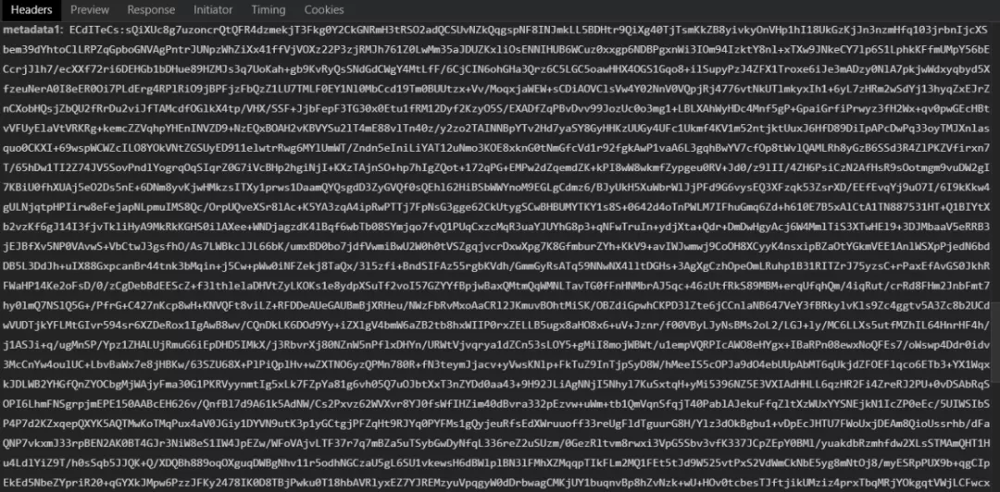

> 对于爬虫工作者而言，如何有效的开发属于自己的爬虫项目？

我们都知道，爬虫的手段多种多样，随着时间推移还将出现更加牛逼的爬虫手段！！

我刚开始接触爬虫的时候也是从`pc端`开始获取网页源码进行解析，或者是通过网站后台返回的`ajax`接口来获取数据， 这都是非常常见的爬虫手段。

但是随着爬虫行业越来越被重视，反爬手段也在不断的加强，常规的爬虫手段实际上已经起不到作用的， 几年前搭建的`动态代理` `ip` 和随机 `ua请求头`就可以拿到数据的时代彻底过去，人们对数据的安全和重要性越来越重视， 可见`爬虫`
是一种多么重要的职业。

现在我们就来谈谈具体是怎么来开发我们的爬虫项目。

### 分析协议

这一步非常重要，也是分析目标网站的第一步，如果目标网站是`pc端`的产物， 我们一般会使用抓包工具来进行抓包或者使用`chrome`浏览器 自带的调试器进行网络请求的拦截，
以此来得出如何构造网络请求来得到我们所需的数据，然后用你喜欢的语言，比如`Python`来进行代码的编写。

一切似乎都在优雅的进行着，啪啪！！ 为啥抓包工具抓不到有效的数据包？ 为啥网页源码只有一段简单的`js`代码？
`ajax` 后面拼接的一堆恶心的没有规律的字符串又是啥？ 网页上正常显示的字体在网页源码中成了一个个的小框框？

这...... 别急， 你看到的这些反爬虫手段也只是一些经常出现的常规性手段， 越深入你会越觉得手段越来越多， 越来越变态。

上面我们说的都是围绕着`pc端`的`爬虫`和`反爬虫`， `pc端`总体上来说要比`App`更容易分析网络请求的`协议`， 我们可以很容易的进行网络拦截，但是处于pc端的网站也更容易设计一些变态的`反爬虫`，
`验证码`，`js前端加密`，`代码混淆`这些也都是常见的手段。

所以对于一些`初级爬虫者`来说，通常很容易拿到请求的`url` 和 `参数`形式， 但就是找不到前端的加密方法和如何绕过的方案，可见而不可达呀！！

`pc端反爬虫`虽然变态，但也不是铁板一块， 要不一大批爬虫工程师就该去卖煎饼果子了（卖煎饼果子其实很不错）， 我们还是有办法解决这些难题的。但这就要看你的作为了， 破解只是时间问题罢了，这里我们不讨论具体的破解的方法和套路，这个话题太大
！！

说了这么多，终于可以说回我们今天的标题了，` pc端`不行那我们就走`App`，也就是`移动端`， 网络协议一般来说不会有区别，所以如果一个网站同时存在pc端和app端， 并且在pc端碰到瓶颈，一时无法解决的时候，就要考虑去抓下app包，
甚至有一些还同时存在着微信小程序和支付宝小程序，这些都是你获取数据的战场， 并且作为一个不再是新手的爬虫告诉你，这些移动端的反爬措施要比pc端来的弱，不管是从参数加密还是验证码出现的频率 ，还是自动化工具的检测都比较弱，近几年`app爬虫`
的热潮一直都在攀升，移动端的使用人群也是越来越多，很多的网站也都在做`app`的转型， 这也算是大势所趋。由此可见`app爬虫`在爬虫界占有的地位，所以这个`app爬虫`系列也由此诞生！！

对于`app爬虫`而言，是否能够熟悉的使用各种爬虫和逆向工具就显得尤为重要， 工欲善其事必先利其器， 工具的使用很大程度上是决定你爬虫效率的最大因素， 下面就根据常见的工具来进行逐一介绍，算是列个`清单`，哈哈。

### Charles

使用爬虫开发你不得不知道的抓包工具，`Charles`不只是针对`app`的网络请求的拦截，在`pc端`的网站中也是适用的。

和一般的抓包工具一样，`Charles`支持`SSL`代理了，拦截`SSL`请求，网络调试，重发和编辑网络请求等操作。

### Fiddler

这个工具也是爬虫中非常主流的抓包工具，跟`Charles`有异曲同工之妙，我个人觉得区别不大，看个人的喜好倾向了。

### JEB

一款非常使用的安卓分析利器，底层是`Java`实现的，是处理`app反编译`的一把利刃。

### jadx

也是一款反编译的利器，支持命令行的操作，支持`apk`，`jar`等格式的文件，完成`apk反编译`得到源码。

### Apk helper

这是一种`apk查壳`的工具，传入apk文件，可以查看`apk`详情，应用权限，是否有使用加固，使用何种加固等等

### PKiD

另一种查壳的工具，比较小众，但是同样优秀

### HTTPCanary

运行在移动端上的抓包工具，并且非常主流，使用简单，上手流畅，功能强大

### ProxyDroid

全局代理了机器人，如果你抓不到`app`的数据包，它会是你的第一选择

### Xposed

一款可以在不修改 `APK` 的情况下影响程序运行的框架，比较底层，插件诸多，是一种 `Android hook` 的不错的方式

### JustTrustMe

绕过证书验证的利器，基于`Xposed`写的反`SSL Pinning`工具

### Frida

一款`Python`实现的`Hook`框架，在 `Android` 领域可谓是大有作为，支持脚本交互，注入工具`frida-server`，可以实现安卓跟系统的 `Hook` 交互，灵活性大

> 再来看看`app`自动化常用的工具

### Appium

老牌的`app自动化测试`工具了，`pc` 有 `Selenium`，`app` 有 `Appium`，唉，一对难兄难弟。

当接口难以分析无从下手时，可以考虑`Appium`作为抓取的一种策略，结合 `Python` 脚本实现。

### AirTest

网易出品的一款自动化测试工具，基于`图像识别`和`poco控件`的`UI`自动化工具，功能也是极其的强大，在群控方面作用极佳

> 这就是我平常使用app爬虫工具，列取了一些具有代表性的工具，除此之外还有很多功能强大的工具，爬虫这个领域太大了。

> 好的工具能让你的爬虫效率提升一个档次，头发能不能保住可就说不准了。

