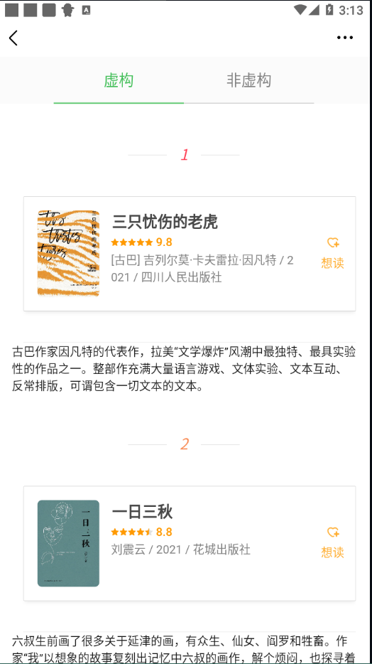
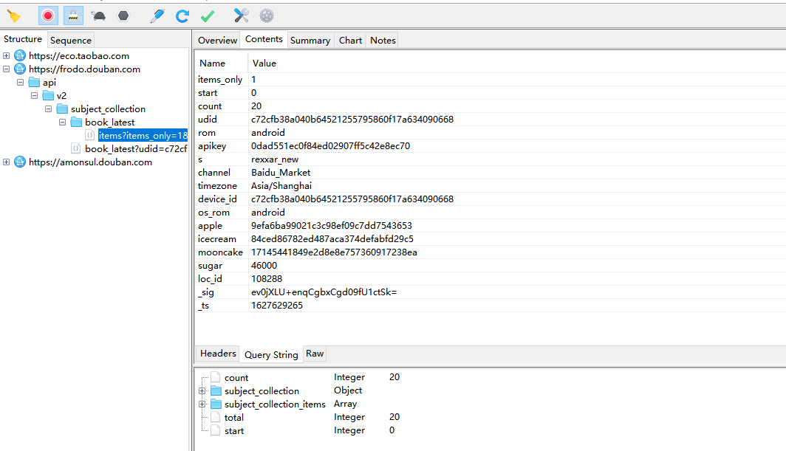
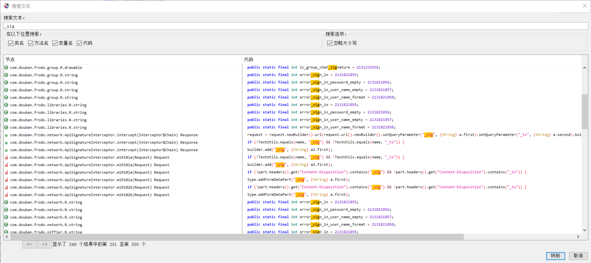

拦截 `App` 应用背后传输的数据包，首先我们需要用到抓包工具

## Charles

青花瓷是一把抓包利器，`Charles` 不只是针对`app` 的网络请求的拦截，在 `pc端` 的网站中也是适用的。

抓包工具配置 详见于 [抓包配置](../抓包配置/readme.md)

## 以"豆瓣"为例

- 在逍遥模拟器的应用市场中安装 `豆瓣app`
- `模拟器/真机` 设置中填写正确的`代理服务器`以及`端口`配置
- 在电脑(假如你是 `Win10`) 和模拟器中 安装 `Charles` 证书

进来豆瓣图书模块、抓一下包看看

---


---



啊啊啊啊 !!

这豆瓣现在这么牛逼了吗，不是小白练手网站吗?

这么多加密参数了?

不是数据随便拿吗?

## 去除无意义参数

首先去除掉那些没有意义的参数，最小化参与请求的参数，没用的统统去掉。

```shell
 {
    "tags": "",
    "refresh": 0,
    "selected_categories": {},
    "start": 0,
    "count": 8,
    "udid": "c72cfb38a040b64521255795860f17a634090668",
    "rom": "android",
    "apikey": "0dad551ec0f84ed02907ff5c42e8ec70",
    "s": "rexxar_new",
    "channel": "Baidu_Market",
    "timezone": "Asia/Shanghai",
    "device_id": "c72cfb38a040b64521255795860f17a634090668",
    "os_rom": "android",
    "apple": "9efa6ba99021c3c98ef09c7dd7543653",
    "icecream": "84ced86782ed487aca374defabfd29c5",
    "mooncake": "17145441849e2d8e8e757360917238ea",
    "sugar": 46000,
    "loc_id": 108288,
    "_sig": "vBgqG16HJEJK8hTAjyQFZmqO6+o=",
    "_ts": 1627624168,
}
```
这可不兴猜啊，不过大概估摸了一下:

`udid && device_id`  都是设备号、是个常量，

`os_rom && rom` 是操作系统，

`mooncake && icecream` 无意义参数、去掉，

`apikey && apple` 常量、固定不变，

`loc_id` 这是模块id(这里是新书速递)，

`_ts` 时间戳(10位)，

`_sig` 参数，不用看，所有参数中需要破解的参数就是它了。

## 搜索 `_sig`

在 charles 中尝试搜索一下 _sig，发现都是在 params 中已经携带过来的。
一点生成 _sig 的痕迹都没有。

## 反编译 `豆瓣apk`

这里用到的反编译工具是 `jadx-gui`

直接搜索 `_sig` 并试图找到有关 `params` 请求参数的方法，最终定位到 其加密的类，代码如下:



```shell
public class ApiSignatureHelper {
    static Pair<String, String> a(Request request) {
        if (request == null) {
            return null;
        }
        String header = request.header(com.douban.push.internal.api.Request.HEADER_AUTHORIZATION);
        if (!TextUtils.isEmpty(header)) {
            header = header.substring(7);
        }
        return a(request.url().toString(), request.method(), header);
    }

    public static Pair<String, String> a(String str, String str2, String str3) {
        String decode;
        if (TextUtils.isEmpty(str)) {
            return null;
        }
        String str4 = FrodoApi.a().e.b;
        if (TextUtils.isEmpty(str4)) {
            return null;
        }
        StringBuilder sb = new StringBuilder();
        sb.append(str2);
        String encodedPath = HttpUrl.parse(str).encodedPath();
        if (encodedPath == null || (decode = Uri.decode(encodedPath)) == null) {
            return null;
        }
        if (decode.endsWith("/")) {
            decode = decode.substring(0, decode.length() - 1);
        }
        sb.append(StringPool.AMPERSAND);
        sb.append(Uri.encode(decode));
        if (!TextUtils.isEmpty(str3)) {
            sb.append(StringPool.AMPERSAND);
            sb.append(str3);
        }
        long currentTimeMillis = System.currentTimeMillis() / 1000;
        sb.append(StringPool.AMPERSAND);
        sb.append(currentTimeMillis);
        return new Pair<>(HMACHash1.a(str4, sb.toString()), String.valueOf(currentTimeMillis));
    }
}
```

其中 `HMACHash1` 类如下:
```shell
public class HMACHash1 {
    public static final String a(String str, String str2) {
        try {
            SecretKeySpec secretKeySpec = new SecretKeySpec(str.getBytes(), LiveHelper.HMAC_SHA1);
            Mac instance = Mac.getInstance(LiveHelper.HMAC_SHA1);
            instance.init(secretKeySpec);
            return Base64.encodeToString(instance.doFinal(str2.getBytes()), 2);
        } catch (Exception e) {
            e.printStackTrace();
            return null;
        }
    }
}
```


## APP 签名秘钥

来到这里，对于 `HMACHash1.a` 中传入的 key 我一直不知道从何而来。

不行，先 Google 一波，终于发现一篇文章中有比较详细的介绍到这个 `key` 是怎么来的。

> [https://blog.csdn.net/qq_23594799/article/details/108446352](https://blog.csdn.net/qq_23594799/article/details/108446352)

这回算是破案了。最后得到的这个秘钥值是 `bf7dddc7c9cfe6f7`，我们根据这个来进行 `sha1` 加密即可。
但是这都是java代码的实现啊，我们需要将其转换成 `Python` 版本。

## 用 Python 复写加密流程

```python
import hashlib
import hmac
import base64
from urllib import parse
API_SECRET_KEY = "bf7dddc7c9cfe6f7"

def gen_sign(url: str, ts: int, method='GET') -> str:
    """
    :param url: api
    :param ts: 时间戳
    :param method: 请求方法（大写 GET POST）
    :return:
    """
    url_path = parse.urlparse(url).path
    raw_sign = '&'.join([method.upper(), parse.quote(url_path, safe=''), str(ts)])
    print(raw_sign)
    return base64.b64encode(hmac.new(API_SECRET_KEY.encode(), raw_sign.encode(), hashlib.sha1).digest()).decode()

print(gen_sign(url="https://frodo.douban.com/api/v2/book/recommend", ts=1627624168))
```

得到 `_sig` 的值
```shell
vBgqG16HJEJK8hTAjyQFZmqO6+o=
```

集成代码

```python
import base64
import hashlib
import hmac
import time
from urllib import parse

import requests
from requests.exceptions import ConnectionError


class GetD():
    def __init__(self):
        self.headers = {
            "User-Agent": "Rexxar-Core/0.1.3 api-client/1 com.douban.frodo/7.11.1(220) Android/25 product/VOG-AL00 vendor/HUAWEI model/VOG-AL00  rom/android  network/wifi  udid/c72cfb38a040b64521255795860f17a634090668  platform/AndroidPad nd/1 com.douban.frodo/7.11.1(220) Rexxar/1.2.151  platform/AndroidPad 1.2.151",
        }

        self.r = requests.session()

    def get_html(self, url):
        t_ = int(time.time())

        params = {
            "tags": "",
            "refresh": 0,
            "selected_categories": {},
            "start": 0,
            "count": 8,
            "udid": "c72cfb38a040b64521255795860f17a634090668",
            "rom": "android",
            "apikey": "0dad551ec0f84ed02907ff5c42e8ec70",
            "s": "rexxar_new",
            "channel": "Baidu_Market",
            "timezone": "Asia/Shanghai",
            "device_id": "c72cfb38a040b64521255795860f17a634090668",
            "os_rom": "android",
            "apple": "9efa6ba99021c3c98ef09c7dd7543653",
            # "icecream": "84ced86782ed487aca374defabfd29c5",
            # "mooncake": "17145441849e2d8e8e757360917238ea",
            "sugar": 46000,
            "loc_id": 108288,
            "_sig": self.get_sig(url=url, ts=t_),
            "_ts": t_,
        }
        try:
            req = self.r.get(url, params=params, headers=self.headers)
            if req.status_code == 200:
                req.encoding = req.apparent_encoding
                return req.json()
            return None
        except ConnectionError:
            return None

    def parse_json(self, json_data):
        print(json_data)

    def get_sig(self, url: str, ts: int, method='GET') -> str:
        """
        :param url: api
        :param ts: 时间戳
        :param method: 请求方法（大写 GET POST）
        :return:
        """
        url_path = parse.urlparse(url).path
        raw_sign = '&'.join([method.upper(), parse.quote(url_path, safe=''), str(ts)])
        return base64.b64encode(
            hmac.new("bf7dddc7c9cfe6f7".encode(), raw_sign.encode(), hashlib.sha1).digest()).decode()

    def run(self):
        json_data = self.get_html(url="https://frodo.douban.com/api/v2/book/recommend")
        self.parse_json(json_data)


if __name__ == '__main__':
    G = GetD()
    G.run()
```

## 嘿嘿
这样一个比较通用的 app 爬虫就搞定了。

现在豆瓣都开始做反爬虫了吗?
