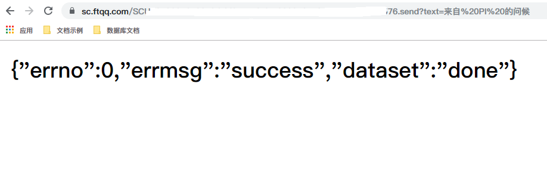
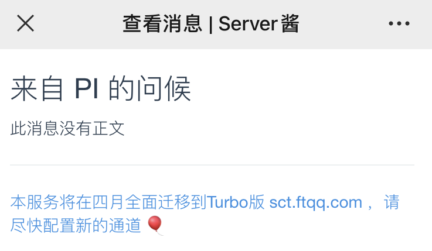

## `Server酱`
关于类如消息推送或机器人管理方面微信开放文档并没有给出简单易用的 `API` 接口， 这里使用的是 `Server酱` 服务推送通知。

> [Server酱](http://sc.ftqq.com/?c=code)

你只需要`注册/登陆` `Server酱` 平台并扫码绑定微信公众号，对，`Server酱`本质是一个公众号，一个可以为你推送通知信息的公众号。

成功绑定后返回一个 `SCKEY`，相当于一个认证 `KEY`，用他们的话说，`SCKEY` 是非常重要的，所以请妥善保存，不要随便告诉别人。另外同样内容的消息一分钟只能发送一次，服务器只保留一周的消息记录。

具体接口如下:

`https://sc.ftqq.com/[SCKEY].send`

它接受两个参数：
- `text`：消息标题，最长为`256`，必填。
- `desp`：消息内容，最长`64Kb`，可空，支持`MarkDown`。


> PS: 此接口同时支持 `GET` 和 `POST` 请求。虽然我觉得并不合理，但它还是这么做了


所以你甚至没有必要编写代码，在浏览器地址栏键入`API`并传入必要参数也能发送通知，比如
`https://sc.ftqq.com/[SCKEY].send?text=来自 PI 的问候`

不出所料，很快就收到了一条来自 `PI` 哥的问候




## `Python` 实现

```python
# -*- coding: utf-8 -*
# @Time : 2020/10/30 9:48

import requests

# 是否开启微信通知
notice_enable = True
# server酱key
sckey = "SCU121832T2c26e......ac5f9b79369b576"
# 信息主体
desp = ''' 
**杭州天气** \n
> 900度，西北风1级，空气良8009，相对温度673%\n
> [](https://www.dingtalk.com)\n
> ###### 10点20分发布 [天气](https://www.dingtalk.com) \n
'''
message = {
    "subject": "来自 PI 的问候",
    "content": desp
}


class SendMsg(object):
    def send(self, message):
        if not notice_enable:
            print("未开启微信通知")
            return
        url = f"https://sc.ftqq.com/{sckey}.send"
        r = requests.post(url, data={"text": f'{message["subject"]}', "desp": message["content"]})
        if r.status_code == requests.codes.ok:
            print("微信通知发送成功")
        else:
            print("微信通知发送失败")


S = SendMsg()
S.send(message)
```


> 与浏览器地址栏相反，我们提交了一个 `POST` 请求，并且使用了`Markdown` 语法，大大增强了可读性。
