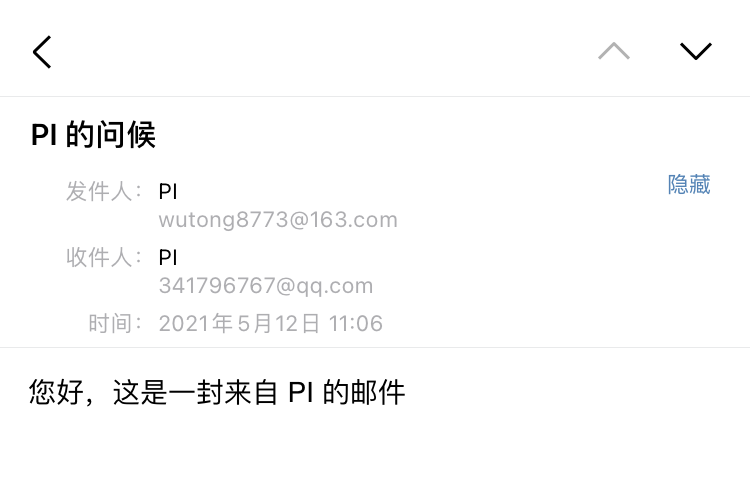
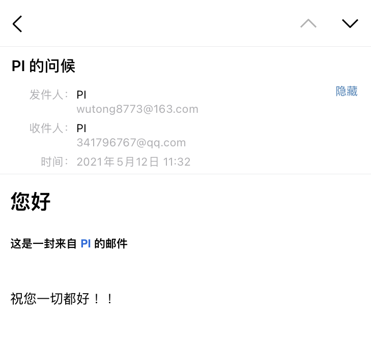
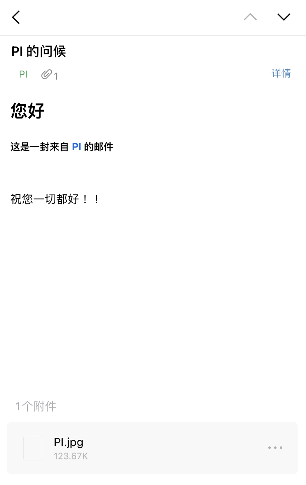
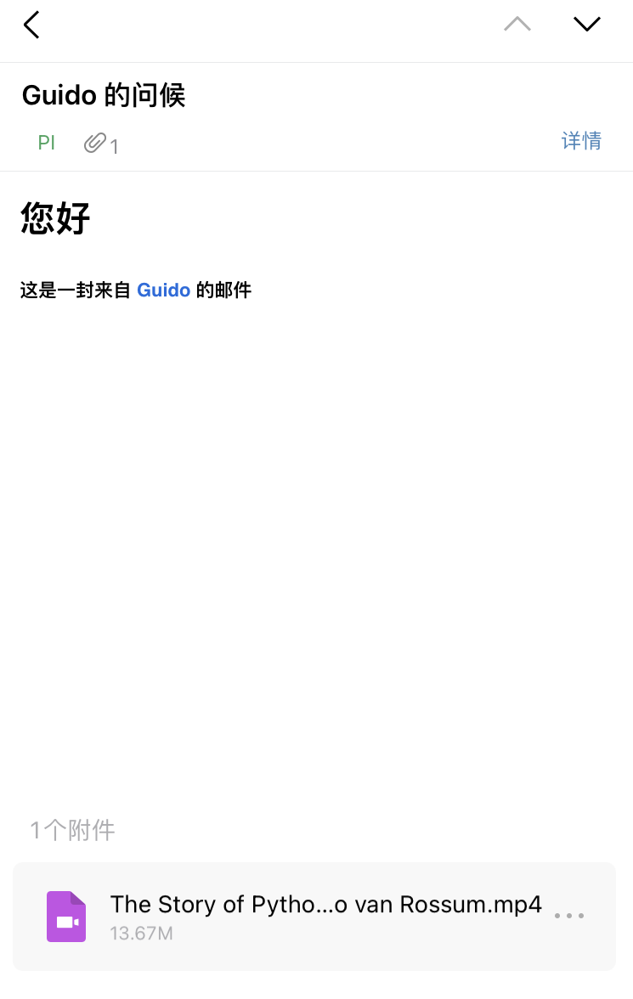
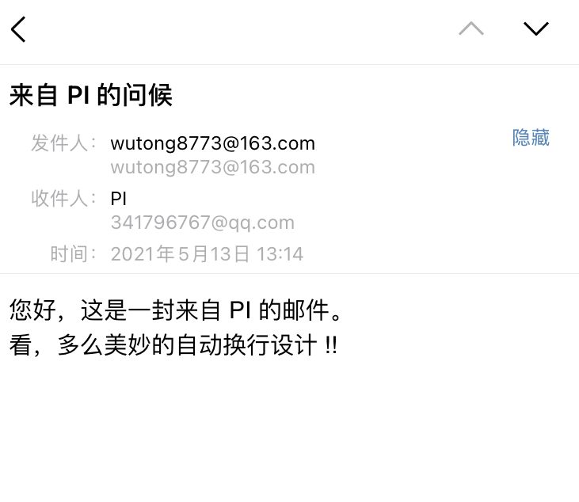

## `Smtplib`

### 邮件推送应用场景

- 当自动化程序结束(`成功`、`失败`、`警告`、`报错原因`) 时推送，类似于充当程序回调的`钩子方法`
- 批量自动化发送邮件 (非恶意邮箱轰炸)
- 任何你能想到的使用场景

> 我们使用 `smtplib` 和 `email` 库来驱动邮件操作

### 发送 `Text` 邮件

我们直接引用`廖雪峰`网站上的一个小栗子

```python
# -*- coding: utf-8 -*-
from email.header import Header
from email.mime.text import MIMEText
import smtplib

from_addr = "wutong8773@163.com"  # 发送邮箱地址
password = ""  # 邮箱授权码
to_addr = "341796767@qq.com"  # 接收邮箱地址
smtp_server = "smtp.163.com"  # 邮箱服务器

msg = MIMEText('您好，这是一封来自 PI 哥的邮件', 'plain', 'utf-8')  # 正文
msg['From'] = 'PI <%s>' % from_addr
msg['To'] = '管理员 <%s>' % to_addr
msg['Subject'] = Header('来自 PI 的问候', 'utf-8').encode()

server = smtplib.SMTP(smtp_server, 25)
server.set_debuglevel(1)  # 调式等级，生产环境禁用
server.login(from_addr, password)  # 登陆邮箱服务
server.sendmail(from_addr, [to_addr], msg.as_string())  # 开始发送
server.quit()  # 退出
```

我们使用 `Python` 自带的`smtplib` 和 `email` 库编写了一个极其简单的邮件发送器。

可以看到代码中使用了 `163` 的邮箱服务器，需要注意的可能是:

- 登陆是使用邮箱`授权码`而非登陆密码，授权码在邮箱设置中找到并生成
- 不同的邮箱对应着不同的邮箱服务器，比如 `163` 邮箱对应着 `smtp.163.com` 而 `QQ` 邮箱是 `smtp.qq.com`
- `msg['To']` 可以接收多个邮件地址，用`,`分隔即可

很快，我就收到了一封来自 `PI` 哥的邮件

---


### 发送 `Html` 邮件

在一些特定的场景可能需要更具美感的前端样式 (至少有不少人是这么认为的，我尝试调查过，普遍的人认为应该优先考虑邮箱的样式和排版)，比如企业中员工招聘的邮件指引或员工录取时的样式排版，能最大程度的给人在视觉上的舒适感。

```python
# -*- coding: utf-8 -*-
import smtplib
from email.header import Header
from email.mime.text import MIMEText

from_addr = "wutong8773@163.com"  # 发送邮箱地址
password = ""  # 邮箱授权码
to_addr = "341796767@qq.com"  # 接收邮箱地址
smtp_server = "smtp.163.com"  # 邮箱服务器

# msg = MIMEText('您好，这是一封来自 PI 的邮件', 'plain', 'utf-8')  # 正文

msg = MIMEText('<html><body><h1>您好</h1>' +
               '<h5>这是一封来自 <a href="http://www.python.org" style="text-decoration:none;"> PI </a>的邮件</h5><br><span>祝您一切都好 ！！</span>' +
               '</body></html>', 'html', 'utf-8')  # 正文
msg['From'] = f'PI {from_addr}'
msg['To'] = f'{to_addr}'
msg['Subject'] = Header('PI 的问候', 'utf-8').encode()

server = smtplib.SMTP(smtp_server, 25)
server.set_debuglevel(1)  # 调式等级，生产环境禁用
server.login(from_addr, password)  # 登陆邮箱服务
server.sendmail(from_addr, [to_addr], msg.as_string())  # 开始发送
server.quit()  # 退出
```

上面的代码在 `MIMEText` 对象中把 `plain` 改为 `html`，也就是从`文本`换成了填充`Html`模板了。

很快啊，我就又收到了一封来自 `PI` 哥的邮件，这次的邮件正文带上了 `HTML` 标签，看起来确实舒服了一些 ！！

---


### 附件邮件

你可能还需要发送一些附件，比如图片、文档、表格之类的二进制文件，当然也可以直接在 `Html` 模板中展示

```python
import smtplib
from email import encoders
from email.header import Header
from email.mime.base import MIMEBase
from email.mime.multipart import MIMEMultipart
from email.mime.text import MIMEText

from_addr = "wutong8773@163.com"  # 发送邮箱地址
password = ""  # 邮箱授权码
to_addr = "341796767@qq.com"  # 接收邮箱地址
smtp_server = "smtp.163.com"  # 邮箱服务器

# 邮件对象:
msg = MIMEMultipart()
msg['From'] = f'PI {from_addr}'
msg['To'] = f'{to_addr}'
msg['Subject'] = Header('PI 的问候', 'utf-8').encode()

# 邮件正文是MIMEText:
html_content = MIMEText('<html><body><h1>您好</h1>' +
                        '<h5>这是一封来自 <a href="http://www.python.org" style="text-decoration:none;"> PI </a>的邮件</h5>' +
                        '</body></html>', 'html', 'utf-8')

msg.attach(html_content)  # 正文

# 添加附件就是加上一个MIMEBase，从本地读取一个图片:
with open('C:\\Users\\HP\Desktop\\构建文档\\python-automation-docs\\docs\\办公自动化\\email\\images\\MD示例图.jpg', 'rb') as f:
    # 设置附件的MIME和文件名，这里是png类型:
    mime = MIMEBase('image', 'jpg', filename='PI.jpg')
    # 加上必要的头信息:
    mime.add_header('Content-Disposition', 'attachment', filename='PI.jpg')
    mime.add_header('Content-ID', '<0>')
    mime.add_header('X-Attachment-Id', '0')
    # 把附件的内容读进来:
    mime.set_payload(f.read())
    # 用Base64编码:
    encoders.encode_base64(mime)
    # 添加到MIMEMultipart:
    msg.attach(mime)

text_content = MIMEText('祝您一切都好 ！！', 'plain', 'utf-8')
msg.attach(text_content)  # 正文

server = smtplib.SMTP(smtp_server, 25)
server.set_debuglevel(1)  # 调式等级，生产环境禁用
server.login(from_addr, password)  # 登陆邮箱服务
server.sendmail(from_addr, [to_addr], msg.as_string())  # 开始发送
server.quit()  # 退出
```

- 通过 `with` 关键字读取本地图片并添加至附件
- 可以看到这里用了 `attach` 方法将一个个 `MIME` 对象添加到 `MIMEMultipart()` 中，不同格式下分别添加的正文内容。

这次 `PI` 哥发出了一封带有一张附件图片的邮件

--- 


我们尝试这发送一个附件`视频`，这里我们使用 `Pytube` 去 `Youtube` 下载一个示例视频

```shell
pip install pytube
```

```python
from pytube import YouTube

YouTube('https://www.youtube.com/watch?v=J0Aq44Pze-w').streams.first().download('./videos/')
```

很快我们在 `videos` 目录下得到了一个名为 `The Story of Python by Its Creator Guido van Rossum.mp4` 的 `youtube` 视频，然后尝试在代码中进行改进

```python
# 添加附件就是加上一个MIMEBase，从本地读取视频:
with open('C:\\Users\\HP\Desktop\\构建文档\\python-automation-docs\\docs\\办公自动化\\email\\images\\MD示例图.jpg', 'rb') as f:
    # 设置附件的MIME和文件名，这里是png类型:
    mime = MIMEBase('video', 'mp4', filename='The Story of Python by Its Creator Guido van Rossum.mp4')
    # 加上必要的头信息:
    mime.add_header('Content-Disposition', 'attachment',
                    filename='The Story of Python by Its Creator Guido van Rossum.mp4')
    mime.add_header('Content-ID', '<0>')
    mime.add_header('X-Attachment-Id', '0')
    # 把附件的内容读进来:
    mime.set_payload(f.read())
    # 用Base64编码:
    encoders.encode_base64(mime)
    # 添加到MIMEMultipart:
    msg.attach(mime)
```

我们马上又收到了一封带有`视频附件`的邮件，这里是一段 `The Story of Python by Its Creator Guido van Rossum.mp4`

---


其他的诸如`csv、excel、word、ppt、pdf、`甚至是 `.py` 格式文件都可以以这种方式发送，问题不大。

> [https://docs.python.org/zh-cn/3/library/email.html?highlight=email#module-email](https://docs.python.org/zh-cn/3/library/email.html?highlight=email#module-email)

## `YagMail`

### 发送 `Text` 邮件
除了 `Python` 内置的`smtplib` 和 `email` 库之外，还有很多第三方库同样实现了邮件推送的功能，`yagmail` 在 `Github` 上有着 `2k+` `star`，

很大原因是因为其易用性，用极少量的代码就可以实现邮件发送的功能。

> [https://github.com/kootenpv/yagmail](https://github.com/kootenpv/yagmail)

```shell
pip install yagmail[all]
```

```python
# -*- coding: utf-8 -*-
import yagmail

from_addr = "wutong8773@163.com"  # 发送邮箱地址
password = ""  # 邮箱授权码
to_addr = "341796767@qq.com"  # 接收邮箱地址
smtp_server = "smtp.163.com"  # 邮箱服务器

# 链接邮箱服务器
yag = yagmail.SMTP(user=from_addr, password=password, host=smtp_server)

# 邮箱正文
contents = ['您好，这是一封来自 PI 的邮件。', '看，多么美妙的自动换行设计 !!']

# 发送邮件
yag.send(to_addr, '来自 PI 的问候', contents)
```

从短短的几行代码我们就处理完了发件功能，这不得不感叹 `Python` 之美，这得益于 `yagmail` 内部已经封装的足够优秀。

很快就又收到了 `PI` 哥的邮件问候

---



### 发送`多个`邮件

您稍微动动手，把 `to_addr` 改成`列表`(`元组`、`集合`)，里面存放`邮件`即可

`to_addr = ['to@someone.com', 'for@someone.com']`

### 发送 `Html` 邮件

```python
import yagmail

from_addr = "wutong8773@163.com"  # 发送邮箱地址
password = ""  # 邮箱授权码
to_addr = "341796767@qq.com"  # 接收邮箱地址
smtp_server = "smtp.163.com"  # 邮箱服务器

# 链接邮箱服务器
yag = yagmail.SMTP(user=from_addr, password=password, host=smtp_server)

# 邮箱正文
contents = ['<html><body><h1>您好</h1>' +
            '<h5>这是一封来自 <a href="http://www.python.org" style="text-decoration:none;"> PI </a>的邮件</h5><br>' + '<span>看，多么美妙的一致性 !!</span></body></html>', ]

# 发送邮件
yag.send(to_addr, '来自 PI 的问候', contents)
```

噢！多么美妙的`一致性`，你只要保证你的 `Html` 模板不出问题，`yagmail` 就能正确解析到 `Html` 标签，
如果您有足够的兴趣，`yagmail` 的`源码`会告诉你它的 `content` 参数的强大之处。

### 发送附件

```python
import yagmail
from_addr = "wutong8773@163.com"  # 发送邮箱地址
password = ""  # 邮箱授权码
to_addr = "341796767@qq.com"  # 接收邮箱地址
smtp_server = "smtp.163.com"  # 邮箱服务器

# 链接邮箱服务器
yag = yagmail.SMTP(user=from_addr, password=password, host=smtp_server)

# 邮箱正文
contents = ['<html><body><h1>您好</h1>' +
            '<h5>这是一封来自 <a href="http://www.python.org" style="text-decoration:none;"> PI </a>的邮件</h5><br>' + '<span>看，我给你发了两张附件图片 !!</span>'
                                                                                                              '</body></html>', ]

# 发送邮件
yag.send(to=to_addr, subject='来自 PI 的问候', contents=contents,
         attachments=['./images/MD示例图.jpg',  './images/YAGMAIL_附件.png'])
```

通过指定 `attachments` 参数，这个参数接收一个`列表`(发送多个附件，比如上面的代码)或`文件对象`

```python
import yagmail
from_addr = "wutong8773@163.com"  # 发送邮箱地址
password = ""  # 邮箱授权码
to_addr = "341796767@qq.com"  # 接收邮箱地址
smtp_server = "smtp.163.com"  # 邮箱服务器

# 链接邮箱服务器
yag = yagmail.SMTP(user=from_addr, password=password, host=smtp_server)

# 邮箱正文
contents = ['<html><body><h1>您好</h1>' +
            '<h5>这是一封来自 <a href="http://www.python.org" style="text-decoration:none;"> PI </a>的邮件</h5><br>' + '</body></html>', ]

# 发送邮件
with open('./images/MD示例图.jpg', 'rb') as f:
    f.filename ="PI.jpg"
    yag.send(to=to_addr, subject='来自 PI 的问候', contents=contents,attachments=f)

yag.feedback("邮件发送成功")
yag.close()
```

通过 源码可以知道 `yagmail` 也是基于 `smtplib` 和 `email` 库构建的。

```python
class SMTP:
    """ :class:`yagmail.SMTP` is a magic wrapper around
    ``smtplib``'s SMTP connection, and allows messages to be sent."""

    def __init__(
        self,
        user=None,
        password=None,
        host="smtp.gmail.com",
        port=None,
        smtp_starttls=None,
        smtp_ssl=True,
        smtp_set_debuglevel=0,
        smtp_skip_login=False,
        encoding="utf-8",
        oauth2_file=None,
        soft_email_validation=True,
        **kwargs
    ):
        self.log = get_logger()
        self.set_logging()
        self.soft_email_validation = soft_email_validation
        if oauth2_file is not None:
            oauth2_info = get_oauth2_info(oauth2_file)
            if user is None:
                user = oauth2_info["email_address"]
        if smtp_skip_login and user is None:
            user = ""
        elif user is None:
            user = find_user_home_path()
        self.user, self.useralias = make_addr_alias_user(user)
        if soft_email_validation:
            validate_email_with_regex(self.user)
        self.is_closed = None
        self.host = host
        self.port = str(port) if port is not None else "465" if smtp_ssl else "587"
        self.smtp_starttls = smtp_starttls
        self.ssl = smtp_ssl
        self.smtp_skip_login = smtp_skip_login
        self.debuglevel = smtp_set_debuglevel
        self.encoding = encoding
        self.kwargs = kwargs
        self.cache = {}
        self.unsent = []
        self.num_mail_sent = 0
        self.oauth2_file = oauth2_file
        self.credentials = password if oauth2_file is None else oauth2_info

    def __enter__(self):
        return self

    def __exit__(self, exc_type, exc_val, exc_tb):
        if not self.is_closed:
            self.close()
        return False

    @property
    def connection(self):
        return smtplib.SMTP_SSL if self.ssl else smtplib.SMTP

    @property
    def starttls(self):
        if self.smtp_starttls is None:
            return False if self.ssl else True
        return self.smtp_starttls
```

这里可以看到被装饰的 `connection` 方法中使用 `smtplib` 进行连接服务。


同时下面的代码在判断其邮件信息的`主体类型`的时候使用到了 `email` 库。

```python
def prepare_message(
    user,
    useralias,
    addresses,
    subject,
    contents,
    attachments,
    headers,
    encoding,
    prettify_html=True,
    message_id=None,
    group_messages=True,
):
    # check if closed!!!!!! XXX
    """ Prepare a MIME message """

    if not isinstance(contents, (list, tuple)):
        if contents is not None:
            contents = [contents]
    if not isinstance(attachments, (list, tuple)):
        if attachments is not None:
            attachments = [attachments]
    # merge contents and attachments for now.
    if attachments is not None:
        for a in attachments:
            if not isinstance(a, io.IOBase) and not os.path.isfile(a):
                raise TypeError(f'{a} must be a valid filepath or file handle (instance of io.IOBase). {a} is of type {type(a)}')
        contents = attachments if contents is None else contents + attachments

    if contents is not None:
        contents = [serialize_object(x) for x in contents]

    has_included_images, content_objects = prepare_contents(contents, encoding)
    if contents is not None:
        contents = [x[1] for x in contents]

    msg = MIMEMultipart()
    if headers is not None:
        # Strangely, msg does not have an update method, so then manually.
        for k, v in headers.items():
            msg[k] = v
    if headers is None or "Date" not in headers:
        msg["Date"] = formatdate()

    msg_alternative = MIMEMultipart("alternative")
    msg_related = MIMEMultipart("related")
    msg_related.attach("-- HTML goes here --")
    msg.attach(msg_alternative)
    add_subject(msg, subject)
    add_recipients_headers(user, useralias, msg, addresses)
    add_message_id(msg, message_id, group_messages)
    htmlstr = ""
    altstr = []
    if has_included_images:
        msg.preamble = "This message is best displayed using a MIME capable email reader."

    if contents is not None:
        for content_object, content_string in zip(content_objects, contents):
            if content_object["main_type"] == "image":
                # all image objects need base64 encoding, so do it now
                email.encoders.encode_base64(content_object["mime_object"])
                # aliased image {'path' : 'alias'}
                if isinstance(content_string, dict) and len(content_string) == 1:
                    for key in content_string:
                        hashed_ref = str(abs(hash(key)))
                        alias = content_string[key]
                    # pylint: disable=undefined-loop-variable
                    content_string = key
                else:
                    alias = os.path.basename(str(content_string))
                    hashed_ref = str(abs(hash(alias)))

                # TODO: I should probably remove inline now that there is "attachments"
                # if string is `inline`, inline, else, attach
                # pylint: disable=unidiomatic-typecheck
                if type(content_string) == inline:
                    htmlstr += ''.format(hashed_ref, alias)
                    content_object["mime_object"].add_header(
                        "Content-ID", "<{0}>".format(hashed_ref)
                    )
                    altstr.append("-- img {0} should be here -- ".format(alias))
                    # inline images should be in related MIME block
                    msg_related.attach(content_object["mime_object"])
                else:
                    # non-inline images get attached like any other attachment
                    msg.attach(content_object["mime_object"])

            else:
                if content_object["encoding"] == "base64":
                    email.encoders.encode_base64(content_object["mime_object"])
                    msg.attach(content_object["mime_object"])
                elif content_object["sub_type"] not in ["html", "plain"]:
                    msg.attach(content_object["mime_object"])
                else:
                    if not content_object["is_marked_up"]:
                        content_string = content_string.replace("\n", "<br>")
                    try:
                        htmlstr += "<div>{0}</div>".format(content_string)
                        if PY3 and prettify_html:
                            import premailer

                            htmlstr = premailer.transform(htmlstr)
                    except UnicodeEncodeError:
                        htmlstr += u"<div>{0}</div>".format(content_string)
                    altstr.append(content_string)

    msg_related.get_payload()[0] = MIMEText(htmlstr, "html", _charset=encoding)
    msg_alternative.attach(MIMEText("\n".join(altstr), _charset=encoding))
    msg_alternative.attach(msg_related)
    return msg
```
#### 关于 `yagmail` 的认证部分是这么描述的

- 使用`用户名`和`密钥`，简单地将密码传递给 `yagmail.SMTP`. 如果没有给出密码，`yagmail`将提示用户输入密码，然后将结果存储在`keyring`中。通过简单地传递用户名来实例化客户端。

- `yagmail.register(username, password)` 使用这个可以在你的操作系统的`keyring`中添加一个新的`gmail`帐户，这样它就可以在`yagmail`中使用了

- 另一种身份验证方法是通过传递 `oauth2_file` 到 `yagmail.SMTP` ，这是最安全的身份验证方法之一。例如 `yagmail.SMTP('user@gmail.com', oauth2_file='~/oauth2_creds.json')` 

> [https://www.osgeo.cn/yagmail/api.html](https://www.osgeo.cn/yagmail/api.html)

事实上所谓的 `register` 方法其实就是使用 `keyring.set_password` 方法将`用户信息`注入到 `keyring` (加密文件持久化到本地)

```python
try:
    import keyring
except (ImportError, NameError, RuntimeError):
    pass


def register(username, password):
    """ Use this to add a new gmail account to your OS' keyring so it can be used in yagmail """
    keyring.set_password("yagmail", username, password)
```

> 此外 `yagmail` 还提供了像 `close`、`set_logging` 等方法，详细用法请查看上方文档

> 虽然 `yagmail` 源码实现相对简单，其代码量不大，但这是一个好库，值得我们借鉴和使用

