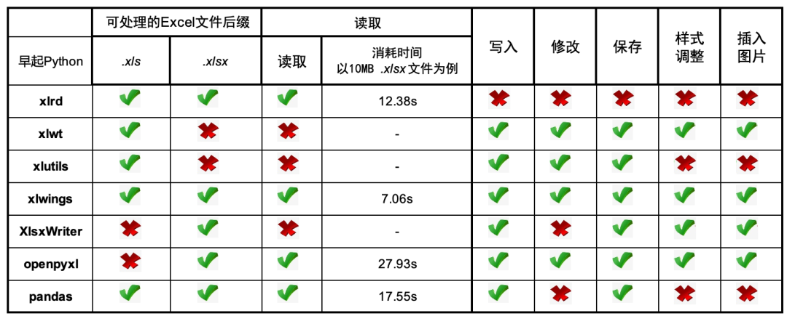

excel是自动化办公领域的主战场，在日常工作中 `excel` 表格操作频繁，对我们的重要程度不言而喻

那么 `Python` 与 `excel` 之间的交互就成了我们关注的话题

### 常见的第三方库

[](http://xlrd.readthedocs.io/en/latest/)
[](https://xlwt.readthedocs.io/en/latest/)
[](http://xlutils.readthedocs.io/en/latest/)
[](http://docs.xlwings.org/en/stable/index.html)

[](https://openpyxl.readthedocs.io/en/stable/)
[](https://xlsxwriter.readthedocs.io/)
[](http://pandas.pydata.org/)




虽然每个库都有其自身的优缺点，都有其适合的应用场景，然而就通用程度而言，
笔者推荐使用 `xlwings` 和 `openpyxl` 库来进行 `excel` 的读写操作。

### 安装
```shell
pip install xlrd
pip install xlwt
pip install xlutils
pip install xlwings
pip install XlsxWriter
pip install openpyxl
pip install pandas
```

> 该文档以 `openpyxl` 为例读写 `excel` 文件
