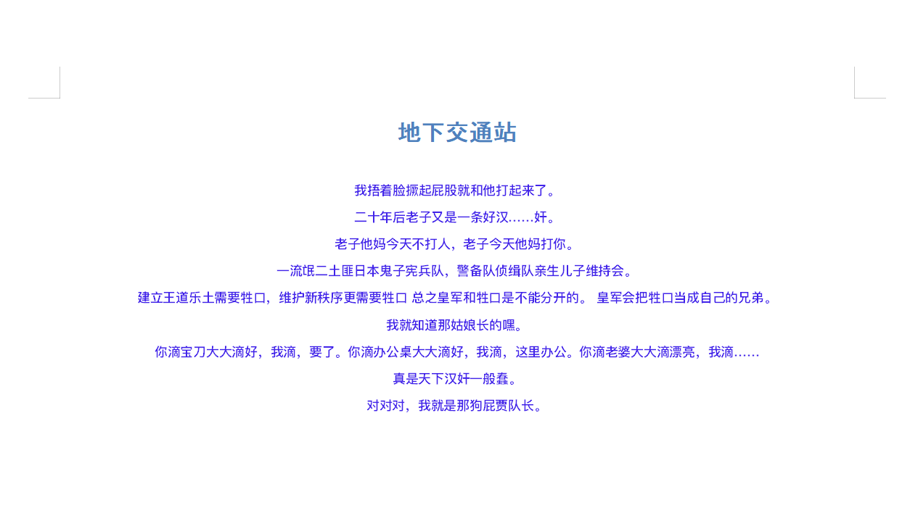

## 安装`Python-docx`

`docx` 并非 `Python` 的标准库，属于第三方扩展，我们通过 `pip` 命令安装:

```shell
pip install python-docx
```

如果因为网络或者其他原因导致 `pip` 无法正常安装

请访问 [https://pypi.org/project/python-docx/](https://pypi.org/project/python-docx/)
手动下载压缩文件并解压后安装

```shell
tar xvzf python-docx-{version}.tar.gz
cd python-docx-{version}
python setup.py install
```


## 快速开始
### 新建文档

```python
from docx import Document
document = Document()
```
这一步非常简易，我们申明一个 `Document` 对象，如果不传入`docx`文档路径的话，默认
打开一个新的空白文档

这种使用缺省参数调起文档对象的方式大大简化了
我们的代码量，变得更加简单

### 保存文档

```python
from docx import Document

document = Document()
document.save("./nihao.docx")
```

`save` 方法用于保存 `docx` 文档

### 尝试写入标题和内容
#### 添加标题
```python
from docx import Document
document = Document()
document.add_heading('地下交通站')
document.add_heading('鼎香楼', level=2)
# document.save("./地下交通站.docx")
```

进入源码查看 `add_heading` 方法
```python
def add_heading(self, text="", level=1):
    """Return a heading paragraph newly added to the end of the document.

    The heading paragraph will contain *text* and have its paragraph style
    determined by *level*. If *level* is 0, the style is set to `Title`. If *level*
    is 1 (or omitted), `Heading 1` is used. Otherwise the style is set to `Heading
    {level}`. Raises |ValueError| if *level* is outside the range 0-9.
    """
    if not 0 <= level <= 9:
        raise ValueError("level must be in range 0-9, got %d" % level)
    style = "Title" if level == 0 else "Heading %d" % level
    return self.add_paragraph(text, style)
```
可以看到 `add_heading` 方法接收了两个参数，
`text`参数是标题文本，而`level`是等级大小，默认是 `一级标题`


#### 添加段落
段落是 `docx` 文档中最主要块级对象，用于写入正文、图片、表格等等
```python
paragraph = document.add_paragraph('贾贵原本是安丘城的一个地痞流氓')
```
使用 `add_paragraph` 方法我们可以写入段落内容，
但是我们更多的是想给内容指定一些样式，自定义一些风格。

`python-docx`支持大部分原生 `docx` 的文本样式
，诸如对齐方式、缩进、行间距、字体大小，字体风格，颜色等等

比如我们准备了一份`地下交通站`的经典语录
```text
我捂着脸撅起屁股就和他打起来了。
二十年后老子又是一条好汉……奸。
老子他妈今天不打人，老子今天他妈打你。
一流氓二土匪日本鬼子宪兵队，警备队侦缉队亲生儿子维持会。
建立王道乐土需要牲口，维护新秩序更需要牲口 总之皇军和牲口是不能分开的。 皇军会把牲口当成自己的兄弟。
我就知道那姑娘长的嘿。
你滴宝刀大大滴好，我滴，要了。你滴办公桌大大滴好，我滴，这里办公。你滴老婆大大滴漂亮，我滴……
真是天下汉奸一般蠢。
对对对，我就是那狗屁贾队长。
```

我们将其写入一段正文段落并加以修饰
```python
from docx import Document
from docx.enum.text import WD_PARAGRAPH_ALIGNMENT
from docx.shared import Pt, RGBColor
from docx.oxml.ns import qn

document = Document()


# 全局指定字体
document.styles['Normal'].font.name = u'.萍方-简'
document.styles['Normal']._element.rPr.rFonts.set(qn('w:eastAsia'), u'.萍方-简')

header = document.add_heading('地下交通站',level=2)

# 设置标题对齐方式为居中对齐
header_format = header.paragraph_format
header_format.alignment = WD_PARAGRAPH_ALIGNMENT.CENTER

text = '''
我捂着脸撅起屁股就和他打起来了。
二十年后老子又是一条好汉……奸。
老子他妈今天不打人，老子今天他妈打你。
一流氓二土匪日本鬼子宪兵队，警备队侦缉队亲生儿子维持会。
建立王道乐土需要牲口，维护新秩序更需要牲口 总之皇军和牲口是不能分开的。 皇军会把牲口当成自己的兄弟。
我就知道那姑娘长的嘿。
你滴宝刀大大滴好，我滴，要了。你滴办公桌大大滴好，我滴，这里办公。你滴老婆大大滴漂亮，我滴……
真是天下汉奸一般蠢。
对对对，我就是那狗屁贾队长。'''

# 申明一个段落
paragraph = document.add_paragraph()

# 设置对齐方式为居中对齐
paragraph_format = paragraph.paragraph_format
paragraph_format.alignment = WD_PARAGRAPH_ALIGNMENT.CENTER

# 设置一个块对象
run = paragraph.add_run(text)

# 设置字体大小和颜色
run.font.size = Pt(7)
run.font.color.rgb = RGBColor(0x42, 0x24, 0xE9) # RGB 

document.save("./地下交通站.docx")
```

#### 做了什么

- 在 `document` 对象中设置了全局字体，**注意: 如果是`docx`不自带的字体风格，需要自行下载字体到本地以供选择**
- 设置了一个`二级标题`
- 通过 `paragraph_format` 属性设置了对齐方式
- 通过 `add_run` 添加块元素并插入准备好的文本
- 设置了正文内容的字体大小和颜色
- 保存文档

文档效果如下




## 插入图片
```python
from docx.shared import Inches
document.add_picture('./盛世美颜贾队长.png', width=Inches(1.0))
```

通过 `add_picture` 方法添加一张`本地图片`到文档，
默认`docx` 库不支持解析添加在线图片地址。

所以如果我们想要添加在线图片的话可以
先通过获取该图片的`二进制流`内容，再通过 `add_picture` 方法添加到文档中

```python
import requests,io
from docx.shared import Inches
url = 'https://www.easyicon.net/api/resizeApi.php?id=1311353&size=128'
io_url = io.BytesIO(requests.get(url).content)
# 添加一张图片
document.add_picture(io_url, width=Inches(1.0))
```

## 插入表格
在`docx`文档中是可以插入和操作表格的
```python
table = document.add_table(rows=2, cols=2)
```

使用 `add_table` 方法添加了一个表格，我们试着通过表格的一些属性和方法来操作单元格

```python
cell = table.cell(0, 1)
cell.text = '嘿，打起来了嘿'
```
`.text` 属性可以给单元格赋值 (赋值或修改)

- `0` 表示第一行
- `1` 表示第二列

> 这里表格的行和列索引都是从0开始的

指定写入行的单元格，通过 `rows` 属性指定某一行或某些行。然后通过行的 `cells` 属性给单元格赋值

```python
row = table.rows[2]
row.cells[0].text = '前几天最热的时候我们家热的快炸了'
row.cells[1].text = '那你开空调啊'
```
- `2` 表示指定了表格中的第 `3` 行
- `0` 表示写入了该行的第 `1` 列
- `1` 表示写入了该行的第 `2` 列

通过 `len` 函数获取表格中行和列的总数
```python
row_count = len(table.rows)
col_count = len(table.columns)
```

#### 逐步添加行和列
当我们无法确定目前文档表格的行数时，可以选择实时添加行或列，
这样可以灵活控制表格的长度和宽度，减少不必要的空行或空列


比如我们不知道数据列表的长度或是需要实时添加行操作，
参考以下代码

```python
items = [
    {"name":"贾贵","desc":"侦缉队队长","createDate":"2021-04-20"},
    {"name":"黄金标","desc":"警备队队长","createDate":"2021-04-21"},
    {"name":"黑藤","desc":"特务机关长","createDate":"2021-04-22"},
    {"name":"孙友福","desc":"鼎香楼掌柜","createDate":"2021-04-23"},
    {"name":"水根","desc":"鼎香楼大伙计","createDate":"2021-04-24"}
]

# 添加表
table = document.add_table(1, 3)
table.style='Medium Grid 1 Accent 1'

# 表头
heading_cells = table.rows[0].cells
heading_cells[0].text = '名字'
heading_cells[1].text = '职务'
heading_cells[2].text = '创建时间'

for item in items:
    cells = table.add_row().cells
    cells[0].text = item["name"]
    cells[1].text = item["desc"]
    cells[2].text = item["createDate"]
```

- 添加了一个 `1` 行 `3` 列的表格，作为添加`表头`用
- 为表格添加一点样式 `Medium Grid 1 Accent 1`
- 使用 `add_row` 方法动态添加行操作

> 关于表格样式列表可以参考 [https://www.cnblogs.com/AbnerLc/p/13375707.html](https://www.cnblogs.com/AbnerLc/p/13375707.html)

我们还可以通过 `len(items[0])` 得到 `items` 列表中字典的长度来作为列的长度

```python
# 添加表
table = document.add_table(1, len(items[0]))
```
## 页眉和页脚
有时候我们会给文档添加页眉和注脚

#### 添加页眉
```python
document = Document()
section = document.sections[0]
header = section.header
paragraph = header.paragraphs[0]
paragraph.text = "鼎香楼"
# paragraph.text = "左对齐文本\t居中文本\t右对齐文本"
paragraph.style = document.styles["Header"]
```

声明一个 `section` 并使用 `header` 属性为文档添加`页眉`

#### 添加页脚
```python
footer = section.footer
paragraph = footer.paragraphs[0]
# 居中显示
paragraph.text = "\t来自地下交通站\t"
```

只需将 `header` 换成 `footer`，为文档添加`页脚` 

> 这里只是列举了 `python-docx` 库的一些常用功能，
> 更多的文档样式和使用方法读者可以使用 `python-docx` 的官方文档
>  [https://python-docx.readthedocs.io](https://python-docx.readthedocs.io)

> 祝你有个好心情 ！！