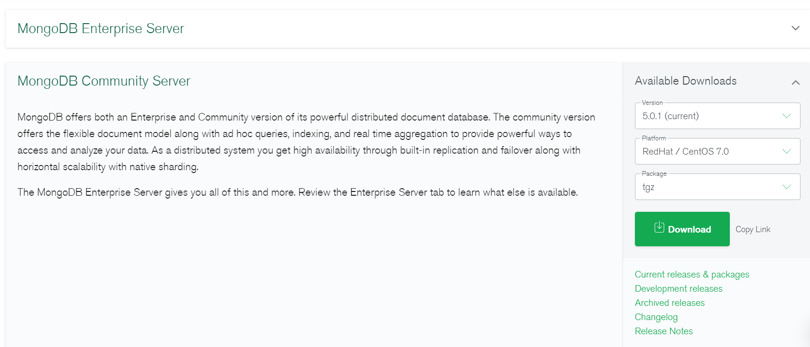
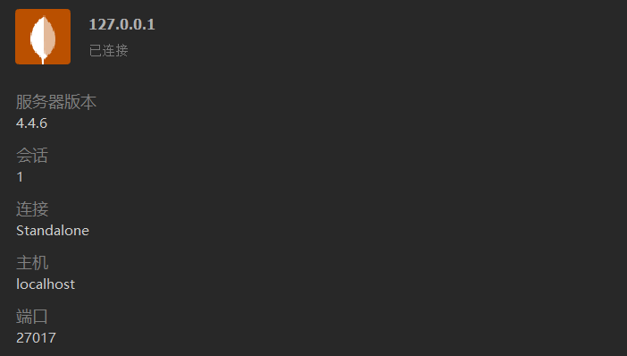

## Centos7 安装 Mongodb

有必要将安装数据库环境依赖写在前面、
> [MongoDB 官网下载地址](https://www.mongodb.com/try/download/community)

#### 选择合适的数据库版本

比如这里选择最新版的 `5.0.1` 版本`红帽`系统、也就是 `centos7.0` 系统啦

---



#### 解压到指定目录

将下载下来的 `tgz` 二进制安装包拖进指定要安装的目录并解压，这里我将其放在 `/usr/local/mongodb5.0.1`

```shell
$ tar zxvf mongodb-linux-x86_64-5.0.1.tgz
```

#### 配置环境变量

```shell
$ vim /etc/profile
```

在其最后加入一下路径即可，问题不大

```shell
export PATH=/usr/local/mongodb5.0.1/bin:$PATH
```

使环境变量生效

```shell
source /etc/profile
```

#### 创建存放数据目录

```shell
$ cd /usr/local/mongodb5.0.1
$ touch mongodb.conf
$ mkdir db
$ mkdir log
$ cd log
$ touch mongodb.log
```

#### 修改/添加 `mongodb` 配置文件

```shell
vim /usr/local/mongodb5.0.1/mongodb.conf
```

```shell
port=27017 #端口
dbpath= /usr/local/mongodb5.0.1/db #数据库存文件存放目录
logpath= /usr/local/mongodb5.0.1/log/mongodb.log #日志文件存放路径
logappend=true #使用追加的方式写日志
fork=true # 以守护进程的方式运行，创建服务器进程
maxConns=100 #最大同时连接数
noauth=true #不启用验证
journal=true #每次写入会记录一条操作日志（通过journal可以重新构造出写入的数据）。
storageEngine=wiredTiger  #存储引擎有mmapv1、wiretiger、mongorocks
bind_ip = 0.0.0.0  #这样就可外部访问了，例如从win10中去连虚拟机中的MongoDB
```

#### 启动测试 `mongodb`

使用我们上面配置文件启动 `mongodb`，本地测试时最好不使用守护进程的方式，将 `fork` 改成 `false` 即可

```shell
$ bin/mongod --config /usr/local/mongodb5.0.1/mongodb.conf
```

此时我们键入在同目录下 `./mongo` 发现可以成功进入数据库，如果非守护进程的方式直接 ctrl+c 退出即可

#### 设置数据库用户名、密码

我们一般会在远程服务器上搭建 `mongodb` 数据库，设置用户名和密码必不可少，否则会出现巨大的风险。

比如一些用户名和密码为空(或是弱口令)的数据库在运行一段时间后全库被清空并留下的一句话，请 支付 `0.2 btc` 到某账户之类的，这些人每时每刻都在寻到认为失误的空档，一旦数据失窃，后果不堪设想。

添加一个`root`权限

```shell
use admin
db.createUser({user:"admin",pwd:"ni_bu_zhi_dao",roles:["root"]})
// 验证是否成功，返回1
db.auth("admin", "ni_bu_zhi_dao")
```

比较推崇的做法是再创建一个管理员账户

```shell
use admin
db.createUser({ user: "admin", pwd: "ni_bu_zhi_dao", roles: [{ role: "userAdminAnyDatabase", db: "admin" }] })
db.auth("admin", "ni_bu_zhi_dao")
```

当然也可以为某个数据库添加一个用户，不造成权限的滥用引发不必要后果

```shell
use nice
db.createUser({user: "nice_admin", pwd: "nice_123", roles: [{ role: "dbOwner", db: "nice" }]})
```

开启认证。

在此前的配置文件的最后加一个认证参数 `auth = true`

并去掉前面的 `noauth = true` 即免认证(当然你在本地测试的时候可以开启)

启动 `mongodb`

```shell
port=27017 #端口
dbpath= /usr/local/mongodb5.0.1/db #数据库存文件存放目录
logpath= /usr/local/mongodb5.0.1/mongodb.log #日志文件存放路径
logappend=true #使用追加的方式写日志
fork=true #以守护进程的方式运行，创建服务器进程
maxConns=100 #最大同时连接数
journal=true #每次写入会记录一条操作日志（通过journal可以重新构造出写入的数据）。
storageEngine=wiredTiger  #存储引擎有mmapv1、wiretiger、mongorocks
bind_ip = 0.0.0.0  #这样就可外部访问了，例如从win10中去连虚拟机中的MongoDB
auth = true #用户认证
```

此时通过远程连接 `mongodb` 数据库的时候会出现用户名、密码验证。

> 如果你忘记了 `mongodb` 的密码 ????

首先注释去掉 `mongodb.conf` 的 `auth` 项，登陆 `mongodb`

```shell
use admin 
db.system.users.find()
db.system.users.remove({})
```

重新设置密码即可

```shell
db.createUser({user:"admin",pwd:"ni_bu_zhi_dao",roles:["root"]})
// 验证是否成功，返回1
db.auth("admin", "ni_bu_zhi_dao")
```

#### 可视化管理工具

`Mongodb` 官方推荐使用 `compass` 作为管理工具，这个工具界面清爽、操作简单、虽然也支持导入导出，然 功能相比其他数据库工具还是稍显不足，我并不将它视为第一选择。

要知道好的 `软件/工具` 再加以娴熟使用能使我们的工作事半功倍、效率奇佳。

现在比较主流的、用的比较多的数据库工具应该是 `Navicat` ，它支持当下一些主流的关系型数据库 和非关系型数据库，比如 `Mysql` 和 `Mongodb` 等等，推荐使用 `Navicat` 。

`DataGrip` 也可以作为一种选择，以编辑器的风格编写 `SQL` 语句或逐渐成为我的一种习惯。 其功能也比较齐全。

需要知道的是 `Navicat` 是收费的，`DataGrip` 也需要解码才能无限制的使用。

当然我们也会有一些左门旁道得到`破解版`和`无限时激活`的方法，嘿嘿你懂 ~~



## Win 安装 Mongodb

`windows` 平台安装 `Mongodb` 相对简单，不再赘述。


