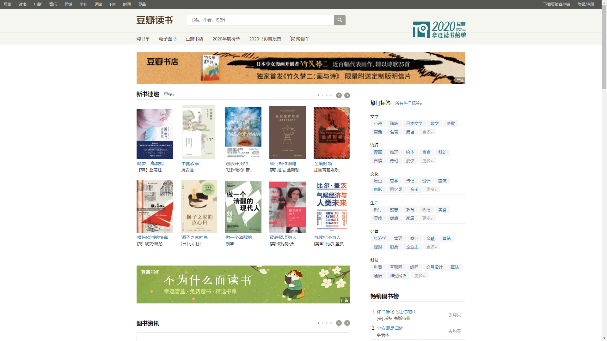

在上一节 [`初始化pyppeteer`](./初始化pyppeteer.md) 中我们已经能够正常唤起浏览器并实现了页面截图。

## 初始化参数

```python
import asyncio, time
from pyppeteer import launch


async def main():
    browser = await launch(headless=False, dumpio=True, autoClose=False,
                           args=['--no-sandbox', '--window-size=1920,1080', '--disable-infobars'])  # 进入有头模式
    page = await browser.newPage()
    await page.setViewport({'width': 1920, 'height': 1080})  # 设置页面大小
    await page.goto('https://www.baidu.com/?tn=99669880_hao_pg')

    # 注入 js 代码，设置 webdriver的值为 false，防止网站检测
    await page.evaluate('''() =>{ Object.defineProperties(navigator,{ webdriver:{ get: () => false } }) }''')
    page_text = await page.content()  # 获取网页源码
    print(page_text)
    await asyncio.sleep(1)


asyncio.get_event_loop().run_until_complete(main()) 
```

`launch`对象可接收的参数非常多，这里列举几个常用参数

- `ignoreHTTPSErrors` 是否忽略 `HTTPS` 错误。默认为 `False`
- `headless`指定浏览器是否以无头模式运行，默认是`True`
- `executablePath` `Chromium`或`Chrome`浏览器的可执行文件路径，如果设置，则使用设置的这个路径，不使用默认设置
- `args `指定给浏览器实例传递的参数
- `--disable-infobars` 代表关闭浏览上方的`Chrome 正受到自动测试软件的控制`
- `--window-size` 设置浏览器的显示大小，一般动态捕捉页面大小后传入
- `--no-sandbox` 是否开启沙盒模式，一般在`docker` 里使用时需要加入的参数(事实证明有时候也不能真正起作用)。
- `--proxy-server` 网络代理

我们可以进到 `Pyppeteer` 中查看一下 `launch` 方法的源码，这里有详细的实例化参数注释

```python
async def launch(options: dict = None, **kwargs: Any) -> Browser:
    """Start chrome process and return :class:`~pyppeteer.browser.Browser`.
    This function is a shortcut to :meth:`Launcher(options, **kwargs).launch`.
    Available options are:
    * ``ignoreHTTPSErrors`` (bool): Whether to ignore HTTPS errors. Defaults to
      ``False``.
    * ``headless`` (bool): Whether to run browser in headless mode. Defaults to
      ``True`` unless ``appMode`` or ``devtools`` options is ``True``.
    * ``executablePath`` (str): Path to a Chromium or Chrome executable to run
      instead of default bundled Chromium.
    * ``slowMo`` (int|float): Slow down pyppeteer operations by the specified
      amount of milliseconds.
    * ``defaultViewport`` (dict): Set a consistent viewport for each page.
      Defaults to an 800x600 viewport. ``None`` disables default viewport.
      * ``width`` (int): page width in pixels.
      * ``height`` (int): page height in pixels.
      * ``deviceScaleFactor`` (int|float): Specify device scale factor (can be
        thought as dpr). Defaults to ``1``.
      * ``isMobile`` (bool): Whether the ``meta viewport`` tag is taken into
        account. Defaults to ``False``.
      * ``hasTouch`` (bool): Specify if viewport supports touch events.
        Defaults to ``False``.
      * ``isLandscape`` (bool): Specify if viewport is in landscape mode.
        Defaults to ``False``.
    * ``args`` (List[str]): Additional arguments (flags) to pass to the browser
      process.
    * ``ignoreDefaultArgs`` (bool or List[str]): If ``True``, do not use
      :func:`~pyppeteer.defaultArgs`. If list is given, then filter out given
      default arguments. Dangerous option; use with care. Defaults to
      ``False``.
    * ``handleSIGINT`` (bool): Close the browser process on Ctrl+C. Defaults to
      ``True``.
    * ``handleSIGTERM`` (bool): Close the browser process on SIGTERM. Defaults
      to ``True``.
    * ``handleSIGHUP`` (bool): Close the browser process on SIGHUP. Defaults to
      ``True``.
    * ``dumpio`` (bool): Whether to pipe the browser process stdout and stderr
      into ``process.stdout`` and ``process.stderr``. Defaults to ``False``.
    * ``userDataDir`` (str): Path to a user data directory.
    * ``env`` (dict): Specify environment variables that will be visible to the
      browser. Defaults to same as python process.
    * ``devtools`` (bool): Whether to auto-open a DevTools panel for each tab.
      If this option is ``True``, the ``headless`` option will be set
      ``False``.
    * ``logLevel`` (int|str): Log level to print logs. Defaults to same as the
      root logger.
    * ``autoClose`` (bool): Automatically close browser process when script
      completed. Defaults to ``True``.
    * ``loop`` (asyncio.AbstractEventLoop): Event loop (**experimental**).
    * ``appMode`` (bool): Deprecated.
    This function combines 3 steps:
    1. Infer a set of flags to launch chromium with using
       :func:`~pyppeteer.defaultArgs`.
    2. Launch browser and start managing its process according to the
       ``executablePath``, ``handleSIGINT``, ``dumpio``, and other options.
    3. Create an instance of :class:`~pyppeteer.browser.Browser` class and
       initialize it with ``defaultViewport``, ``slowMo``, and
       ``ignoreHTTPSErrors``.
    ``ignoreDefaultArgs`` option can be used to customize behavior on the (1)
    step. For example, to filter out ``--mute-audio`` from default arguments:
    .. code::
        browser = await launch(ignoreDefaultArgs=['--mute-audio'])
    .. note::
        Pyppeteer can also be used to control the Chrome browser, but it works
        best with the version of Chromium it is bundled with. There is no
        guarantee it will work with any other version. Use ``executablePath``
        option with extreme caution.
    """
    return await Launcher(options, **kwargs).launch()
```

## 基本用法

### 指定`chromedriver`路径启动浏览器

如果不指定`chromedriver`路径参数，默认从 `pyppeteer.executablePath()` 路径下读取浏览器驱动

通过 `executablePath` 参数指定浏览器路径， 我们将指定本地 chrome 浏览器打开豆瓣读书首页，截图并获取页面源码， 请看以下代码

```python
import asyncio
from pyppeteer import launch


async def main():
    browser = await launch(headless=False,
                           executablePath=r"C:\\Program Files\\Google\\Chrome\\Application\\chrome.exe")  # 有头浏览器
    page = await browser.newPage()  # 打开一个新的标签页
    await page.goto('https://book.douban.com/')  # 豆瓣读书首页
    await page.screenshot({'path': '../images/book_douban.png'})  # 截图
    await asyncio.sleep(2)  # 睡 2 秒
    print(await page.content())  # 获取 html 内容
    await browser.close()  # 关闭浏览器


asyncio.get_event_loop().run_until_complete(main())
```

网页源码 (部分)

```html
<!DOCTYPE html>
<html lang="zh-CN" class="ua-windows ua-webkit book-new-nav">
<head>
    <meta http-equiv="mobile-agent" content="format=xhtml; url=https://m.douban.com/book/">
    <meta name="keywords" content="豆瓣读书,新书速递,畅销书,书评,书单">
    <meta name="description" content="记录你读过的、想读和正在读的书，顺便打分，添加标签及个人附注，写评论。根据你的口味，推荐适合的书给你。">
    <meta name="verify-v1" content="EYARGSAVd5U+06FeTmxO8Mj28Fc/hM/9PqMfrlMo8YA=">
    <meta property="wb:webmaster" content="7c86191e898cd20d">
    <meta property="qc:admins" content="1520412177364752166375">
    <div class="slide-controls">
        <ol class="slide-dots">
            <li><a data-index="1" href="#" class="active"></a></li>
            <li><a data-index="2" href="#" class=""></a></li>
            <li><a data-index="3" href="#" class=""></a></li>
            <li><a data-index="4" href="#" class=""></a></li>
        </ol>
        <div class="slide-btns">
            <a href="#" class="prev">‹</a>
            <a href="#" class="next">›</a>
        </div>
    </div>
    </div>
    <div class="bd">
        <div class="carousel">
            <div class="slide-list" style="width: 4050px; left: -675px;">
                <ul class="list-col list-col5 list-express slide-item clone">


                    <li class="">
                        <div class="cover">
                            <a href="https://book.douban.com/subject/35116757/?icn=index-latestbook-subject"
                               title="死亡的样板">
                                
                            </a>
                        </div>
                        <div class="info">
                            <div class="title">
                                <a class=""
                                   href="https://book.douban.com/subject/35116757/?icn=index-latestbook-subject"
                                   title="死亡的样板">死亡的样板</a>
                            </div>
                            <div class="author">
                                (阿根廷) 豪尔赫· 路易斯·博尔赫斯 (Jorge Luis Borges)&nbsp;/&nbsp;(阿根廷) 阿道夫·比奥伊·卡萨雷斯 (Adolfo Bioy
                                Casares)
                            </div>
                            <div class="more-meta">
                                <h4 class="title">
                                    死亡的样板
                                </h4>
                                <p>
                  <span class="author">
                    (阿根廷) 豪尔赫· 路易斯·博尔赫斯 (Jorge Luis Borges)&nbsp;/&nbsp;(阿根廷) 阿道夫·比奥伊·卡萨雷斯 (Adolfo Bioy Casares)
                  </span>
                                    /
                                    <span class="year">
                    2021-3-31
                  </span>
                                    /
                                    <span class="publisher">
                    上海译文出版社
                  </span>
                                </p>
                                <p class="abstract">

                                    文坛大师博尔赫斯与卡萨雷斯的四手联弹，
                                    看两位文坛大师如何联袂打造侦探故事。
                                    “我们的第二次合作是另一本侦探小说，即《死亡的样板》。小说富有特色，充满了笑话。但只出了一版，并且没有发行。我们给这本作品署的名是B•苏亚雷斯•林奇。B•代表比奥伊和博尔赫斯。苏亚雷斯是我的另一位曾祖的名字，林奇则是比奥伊的另一位曾祖的名字。”
                                    《死亡的样板》是博尔赫...
                                </p>
                            </div>
                        </div>
                    </li>


                    <li class="">
                        <div class="cover">
                            <a href="https://book.douban.com/subject/35268348/?icn=index-latestbook-subject"
                               title="认识世界：古代与中世纪哲学">
                                
                            </a>
                        </div>
                        <div class="info">
                            <div class="title">
                                <a class=""
                                   href="https://book.douban.com/subject/35268348/?icn=index-latestbook-subject"
                                   title="认识世界：古代与中世纪哲学">认识世界：古代与中世纪哲学</a>
                            </div>
                            <div class="author">
                                [德]理查德·大卫·普莱希特
                            </div>
                            <div class="more-meta">
                                <h4 class="title">
                                    认识世界：古代与中世纪哲学
                                </h4>
                                <p>
                  <span class="author">
                    [德]理查德·大卫·普莱希特
                  </span>
                                    /
                                    <span class="year">
                    2021-4
                  </span>
                                    /
                                    <span class="publisher">
                    上海人民出版社
                  </span>
                                </p>
                                <p class="abstract">

                                    “现象级”公共哲学家、畅销作家普莱希特
                                    写给所有关心世界与自己的人
                                    让哲学回归生活，带你清醒看世界
                                    陈嘉映、刘擎、许知远推荐
                                </p>
                            </div>
                        </div>
                    </li>

                </ul>
            </div>
        </div>
```

指定了浏览器路径， 这意味着和我们本地操作的 `chrome` 浏览器使用的是同一个应用， 能共用浏览器的`缓存`，`cookie`会话等等

## 设配大小并移除`Chrome正受到自动测试软件的控制`

由于不同设备的屏幕大小不同，分辨率也不同， 操作时网站内容并没有完整铺满 `chrome` 页面， 我们需要动态的获取到当前操作设备的尺寸来设定当前浏览器页面的大小，避免不必要的程序中断。

```python	
import tkinter
import asyncio
from pyppeteer import launch

def screen_size():
    tk = tkinter.Tk()
    width = tk.winfo_screenwidth()
    height = tk.winfo_screenheight()
    tk.quit()
    return {'width': width, 'height': height}

async def main():
    browser = await launch(headless=False,executablePath=r"C:\\Program Files\\Google\\Chrome\\Application\\chrome.exe",  ignoreDefaultArgs=['--enable-automation'])
    page = await browser.newPage() # 打开一个新的标签页
    await page.setViewport(screen_size()) 
    await page.goto('https://book.douban.com/')  # 豆瓣读书首页
    await page.screenshot({'path': '../images/book_douban.png'})  # 截图
    await asyncio.sleep(2) # 睡 2 秒
    print(await page.content()) # 获取 html 内容
    await browser.close()  # 关闭浏览器

asyncio.get_event_loop().run_until_complete(main())
```

我们通过 `ignoreDefaultArgs=['--enable-automation']` 移除了 `Chrome正受到自动测试软件的控制` 提示

利用 `tkinter` 获取了当前设备的页面大小并使用 `page.setViewport(screen_size())` 方法设置为当前操作页面的大小

截图如下



## 标签选择器

`pyppeteer` 支持 `css选择器`和`xpath选择器`解析

- `Page.querySelector()`  
- `Page.querySelectorAll()` 
- `Page.xpath()`

我们通过一个例子来看看`Pyppeteer选择器`的用法，抓取头条首页的新闻标题和链接
```python
# -*- coding: utf-8 -*-
import asyncio
import tkinter

from pyppeteer import launch

def screen_size():
    tk = tkinter.Tk()
    width = tk.winfo_screenwidth()
    height = tk.winfo_screenheight()
    tk.quit()
    return {'width': width, 'height': height}


async def main():
    browser = await launch(headless=False, ignoreDefaultArgs=['--enable-automation'])

    page = await browser.newPage()
    await page.setViewport(screen_size())

    await page.goto('https://www.toutiao.com/')
    await asyncio.sleep(3) # 等待页面加载完成

    # 使用 xpath 解析页面中的 html 语法树得到新闻的标题和链接
    title_elements = await page.xpath('//div[@class="title-box"]/a')
    for item in title_elements:
        title_str = await (await item.getProperty('textContent')).jsonValue() # 新闻标题
        title_link = await (await item.getProperty('href')).jsonValue() # 新闻链接
        print(title_str)
        print(title_link)
    await browser.close()

asyncio.get_event_loop().run_until_complete(main())
```

通过 `xpath` 解析 `html` 页面，得到标签对象，然后转换成文本输出。


## 绕过 `webdriver` 检测

`pyppeteer` 是一把`web`自动化操作的利器，特别是在`爬虫`领域起到重要的辅助作用，页面自动化抓取数据成了爬虫工程师必备的技能和手段，

这导致了很多的平台对`web`自动化测试框架进行了检测，其中最常见的就是对 `webdriver` 属性的检测，以此来判断当前是否为自动化工具正在操作浏览器。


> [浏览器检测](https://bot.sannysoft.com/)


如果正常使用本地 `chrome` 浏览器访问(非测试工具唤起)一切正常


我们通过` Pyppeteer` 框架访问这个检测网站查看一些属性参数的检测情况

```python
import tkinter
import asyncio
from pyppeteer import launch


def screen_size():
    tk = tkinter.Tk()
    width = tk.winfo_screenwidth()
    height = tk.winfo_screenheight()
    tk.quit()
    return {'width': width, 'height': height}


async def main():
    browser = await launch(headless=False, ignoreDefaultArgs=['--enable-automation'])
    page = await browser.newPage()  # 打开一个新的标签页
    await page.setViewport(screen_size())

    await page.goto('https://bot.sannysoft.com/')
    await page.screenshot({'path': '../images/chrome-headless-test.png'})  # 截图
    await asyncio.sleep(2)  # 睡 2 秒
    print(await page.content())  # 获取 html 内容
    await browser.close()  # 关闭浏览器


asyncio.get_event_loop().run_until_complete(main())
```


果然报红了，意味着当前已经被识别为非正常浏览器头访问，一些网站会以此做出反爬措施，我们需要绕过检测。

在 `pyppeteer` 中提供了一个方法：`evaluate()`，该方法是将一段 `javascript` 代码加载到页面文档中，当发生页面跳转或刷新的时候加载的 `javascript`
代码会自动执行，通过 `javascript`注入的方式来躲过一些网站对浏览器头的检测

```python
import tkinter
import asyncio
from pyppeteer import launch


def screen_size():
    tk = tkinter.Tk()
    width = tk.winfo_screenwidth()
    height = tk.winfo_screenheight()
    tk.quit()
    return {'width': width, 'height': height}


async def main():
    browser = await launch(headless=False, ignoreDefaultArgs=['--enable-automation'])
    page = await browser.newPage()  # 打开一个新的标签页
    await page.setViewport(screen_size())

    await page.setJavaScriptEnabled(enabled=True)  # 启用js
    await page.evaluate('''() =>{ Object.defineProperties(navigator,{ webdriver:{ get: () => undefined } }) }''')
    await page.evaluate('''() =>{ window.navigator.chrome = { runtime: {},  }; }''')
    await page.evaluate('''() =>{ Object.defineProperty(navigator, 'languages', { get: () => ['en-US', 'en'] }); }''')
    await page.evaluate('''() =>{ Object.defineProperty(navigator, 'plugins', { get: () => [1, 2, 3, 4, 5,6], }); }''')

    await page.goto('https://bot.sannysoft.com/')
    await page.screenshot({'path': '../images/chrome-headless-test.png'})  # 截图
    await asyncio.sleep(2)  # 睡 2 秒
    print(await page.content())  # 获取 html 内容
    await browser.close()  # 关闭浏览器


asyncio.get_event_loop().run_until_complete(main())
```


> 可以看到已经绕过了浏览器头信息的检测。

> 参考 [最完美方案！模拟浏览器如何正确隐藏特征](https://mp.weixin.qq.com/s/Bge-_yiatSq4CQq7fRvjdQ)

## 获取 `cookie`

对于`爬虫工程师`来说，`web自动化`操作往往只是为了获取网站在登陆之后的 `cookie`

来看一下 `pyppeteer` 获取 `cookie` 的方法，
我们以登陆豆瓣为例


```python
# -*- coding: utf-8 -*-
import asyncio
import random
import tkinter
from pyppeteer.launcher import launch

class dbLogin():
    def __init__(self):
        pass

    def screen_size(self):
        tk = tkinter.Tk()
        width = tk.winfo_screenwidth()
        height = tk.winfo_screenheight()
        tk.quit()
        return {'width': width, 'height': height}

    async def login(self, username, password, url):
        browser = await launch(
            {
                'headless': False,
            },
            args=['--disable-infobars', '--user-data-dir=./userData'],
        )
        page = await browser.newPage()

        try:
            await page.setViewport(viewport=self.screen_size())

            await page.setJavaScriptEnabled(enabled=True)  # 启用js
            await page.setUserAgent(
                'Mozilla/5.0 (Windows NT 10.0; Win64; x64) AppleWebKit/537.36 (KHTML, like Gecko) Chrome/58.0.3029.110 Safari/537.36 Edge/16.16299'
            )
            await self.page_evaluate(page)
            await page.goto(url)
            await asyncio.sleep(2)
            await page.click('.account-tab-account')
            await asyncio.sleep(1)
            await page.evaluate(f'document.querySelector("#username").value=""') # 执行js代码清空用户名输入框
            await page.type('#username', username, {'delay': self.input_time_random() - 50})   # delay 是限制输入的时间
            await page.evaluate('document.querySelector("#password").value=""') # 执行js代码清空密码输入框
            await page.type('#password', password, {'delay': self.input_time_random()})
            await page.waitFor(3000)
            await page.click('#account > div.login-wrap > div.login-right > div > div.account-tabcon-start > div.account-form > div.account-form-field-submit > a')
            await page.waitFor(6000)
        except:
            return {'code': -1, 'msg': '出错'}
        finally:
            await page.waitFor(3000)
            await self.page_close(browser)


    async def page_evaluate(self, page):
        await page.evaluate('''() =>{ Object.defineProperties(navigator,{ webdriver:{ get: () => undefined } }) }''')
        await page.evaluate('''() =>{ window.navigator.chrome = { runtime: {},  }; }''')
        await page.evaluate(
            '''() =>{ Object.defineProperty(navigator, 'languages', { get: () => ['en-US', 'en'] }); }''')
        await page.evaluate(
            '''() =>{ Object.defineProperty(navigator, 'plugins', { get: () => [1, 2, 3, 4, 5,6], }); }''')
        await page.waitFor(3000)

    async def page_close(self, browser):
        for _page in await browser.pages():
            await _page.close()
        await browser.close()

    def input_time_random(self):
        return random.randint(100, 151)

    def run(self, username='155xxxxxxx3', password='12345678', url='https://accounts.douban.com/passport/login?source=book'):
        loop = asyncio.get_event_loop()
        i_future = asyncio.ensure_future(self.login(username, password, url))
        loop.run_until_complete(i_future)
        return i_future.result()


if __name__ == '__main__':
    J = dbLogin()
    J.run()
```

登陆成功截图


登陆后获取网站 cookie
```python
# -*- coding: utf-8 -*-
import asyncio
import random
import tkinter
from pyppeteer.launcher import launch

class dbLogin():
    def __init__(self):
        pass

    def screen_size(self):
        tk = tkinter.Tk()
        width = tk.winfo_screenwidth()
        height = tk.winfo_screenheight()
        tk.quit()
        return {'width': width, 'height': height}

    async def login(self, username, password, url):
        browser = await launch(
            {
                'headless': False,
            },
            args=['--disable-infobars', '--user-data-dir=./userData'],
        )
        page = await browser.newPage()

        try:
            await page.setViewport(viewport=self.screen_size())

            await page.setJavaScriptEnabled(enabled=True)  # 启用js
            await page.setUserAgent(
                'Mozilla/5.0 (Windows NT 10.0; Win64; x64) AppleWebKit/537.36 (KHTML, like Gecko) Chrome/58.0.3029.110 Safari/537.36 Edge/16.16299'
            )
            await self.page_evaluate(page)
            await page.goto(url)
            await asyncio.sleep(2)
            await page.click('.account-tab-account')
            await asyncio.sleep(1)
            await page.evaluate(f'document.querySelector("#username").value=""') # 执行js代码清空用户名输入框
            await page.type('#username', username, {'delay': self.input_time_random() - 50})   # delay 是限制输入的时间
            await page.evaluate('document.querySelector("#password").value=""') # 执行js代码清空密码输入框
            await page.type('#password', password, {'delay': self.input_time_random()})
            await page.waitFor(3000)
            await page.click('#account > div.login-wrap > div.login-right > div > div.account-tabcon-start > div.account-form > div.account-form-field-submit > a')
            await page.waitFor(6000)
            await self.get_cookie(page)
        except:
            return {'code': -1, 'msg': '出错'}
        finally:
            await page.waitFor(3000)
            await self.page_close(browser)


    async def get_cookie(self, page):
        cookies_list = await page.cookies()
        cookies = ''
        for cookie in cookies_list:
            str_cookie = '{0}={1}; '
            str_cookie = str_cookie.format(cookie.get('name'), cookie.get('value'))
            cookies += str_cookie
        print(cookies)
        return cookies

    async def page_evaluate(self, page):
        await page.evaluate('''() =>{ Object.defineProperties(navigator,{ webdriver:{ get: () => undefined } }) }''')
        await page.evaluate('''() =>{ window.navigator.chrome = { runtime: {},  }; }''')
        await page.evaluate(
            '''() =>{ Object.defineProperty(navigator, 'languages', { get: () => ['en-US', 'en'] }); }''')
        await page.evaluate(
            '''() =>{ Object.defineProperty(navigator, 'plugins', { get: () => [1, 2, 3, 4, 5,6], }); }''')
        await page.waitFor(3000)

    async def page_close(self, browser):
        for _page in await browser.pages():
            await _page.close()
        await browser.close()

    def input_time_random(self):
        return random.randint(100, 151)


    def run(self, username='155xxxxxxx3', password='12345678', url='https://accounts.douban.com/passport/login?source=book'):
        loop = asyncio.get_event_loop()
        i_future = asyncio.ensure_future(self.login(username, password, url))
        loop.run_until_complete(i_future)
        return i_future.result()


if __name__ == '__main__':
    J = dbLogin()
    J.run()
```


> 如果你仍觉得意犹未尽，或者想了解一些更高阶的用法和一些常见问题，请联系作者微信，我将努力做出补充说明。

### 联系作者 
- 如果你有任何关于此文档的问题或者`Python自动化`相关的疑问，请添加作者微信并注明 `Python自动化`

[作者微信](../../打赏和作者/作者微信.md ':include')

### 如何打赏

[打赏作者](../../打赏和作者/微信打赏.md ':include')